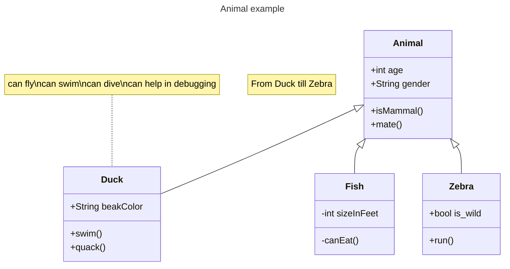

## Presentación

# Repositorio CapaciTechKids para Back

* Diagrama entidad Relación:
 
    
 

# Colaboradores del proyecto:

* [Agustin Cristobo](https://github.com/Fr33yr)

* [Brandon Reyes](https://github.com/Brareyesb15)

* [Fabián Rizzi](https://github.com/Fabian-Rizzi)

* [Guillermo Rodríguez](https://github.com/MemoRodz)

* [Giuliana Schiebelbein](https://github.com/Giudessch)

* [Randy Gutierrez](https://github.com/Randyvangz)

* [Ricardo Ariel Maya](https://github.com/Rickymayita)

* [Sandro Malca Neyra](https://github.com/SandroMalca)

# NOTAS:

Este repositorio se crea para el desarrollo del Back correspondiente al Proyecto Final del Grupo 7 de la Cohorte 33c.